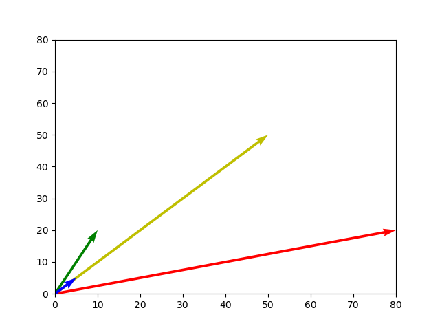

Vector Space
==================
Many NLP models make use of a concept called Vector Space. This is a very complex concept, and so we will be starting with some basic assumptions of the model.
Many of these assumptions will later be broken down or ignored. We are starting with a simple model and will scale up in complexity, modifying our assumptions as we go.

1)	We create __embeddings__, or surrogates, of words and documents in vector space. These embeddings can be represented as sets of coordinates in multidimensional space, or as multi-dimensional matrices.
2)	These embeddings should be based on some sort of __feature extraction__, meaning that meaningful features from our original documents are somehow represented in our embedding. This will make it so that relationships between embeddings in this vector space will correspond to relationships in the actual documents.
3)	We have a __“bag of words”__ assumption as well. We will not consider the placement of words in sentences, their context or their conjugation into different forms (run vs ran) to start. 
The effect of this assumption is like putting all words from a sentence in a bag and considering them by count without regard to order. Later, we’ll talk about models where this no longer holds true.

We start with a very simple set of toy documents. These model documents contain only two words, but we will show how it can be expanded to fit an arbitrarily large vocabulary. 
We will use a 2-dimensional vector space model to represent those words. 
We will say that dimension one represents the number of times word A occurs, and dimension two represents the number of times word B occurs. Let's model three documents.
Document A contains word A 50 times, and word B 50 times. Document B contains word A 80 times, and word B 20 times. Document C contains word A 10 times, and word B 20 times.
Below is how this model looks in a matrix:

| Document   | Word A      | Word B |
| ---------- | ----------- | ----------- |
| Document A | 50 | 50 |
| Document B | 80 | 20 |
| Document C | 10 | 20 |

We can code in these documents as points in Python as well. We do this using Numpy, a math library for Python.

```python
import numpy as np
import scipy as sp	
pointA = np.array((50, 50))
pointB = np.array((80, 20))
pointC = np.array((10,20))
```


Which document is C the most like? 
--------------
One way we could calculate this is by using a distance formula. 
The Euclidian distance formula makes use of the Pythagorean theorem, where a^2 + b^2 = c^2. 
We can draw a triangle between two points, and calculate the hypotenuse to find the distance. 
This distance formula works in two dimensions, but can also be generalized over as many dimensions as we want.

```python
def euclid(pointA, pointB): 
	sum_sq = np.sum(np.square(pointA – pointB))
	print(np.sqrt(sum_sq))
```

Now we can calculate distance between two documents.
```python
euclid(pointA, pointC)
euclid(pointB, pointC)
```

~~~
50
70
~~~

We would conclude that A and C are the most similar because they have the least distance between the two points. 
This is a simple model to determine document similarity. Let’s add another document to our two word model from before- document D. 
Let’s say this document is shorter than the others, but very similar to document A. We'll say the same words are in the same proportions.
In fact, let's say that document A is just document D copy and pasted ten times.


```python
pointD = np.array((5,5))
euclid(pointA, pointD)
euclid(pointB, pointD)
euclid(pointC, pointD)
```


Notice that document A is not the closest document to D! While distance may be an intuitive measure of similarity, it is actually highly dependent on document length. This is why for text analysis we don't just consider documents as points, but rather as vectors. 
Vectors are geometric objects with both length and direction. They can be thought of as a ray or an arrow pointing from one point to another. 
Vectors can be added, subtracted, or multiplied together, just like regular numbers can.
Most models consider documents as vectors, going from the origin at (0,0) to each document, represented by the word count coordinates above.
 

 
Now we can consider a different similarity metric. Instead of using distance as our measure, which is highly dependent on document length, we use a metric called cosine similarity. 
Cosine similarity measures the angle between two vectors without considering the magnitude of the vector, that is, each document’s size. 
It is only concerned with the direction of the vector, not its length. The more similar two vectors are in direction, 
the closer the cosine similarity score gets to 1. And the more orthogonal two vectors get, the closer it gets to 0. 
Think of vectors as signposts aimed out into multidimensional space. Two similar documents might be going in roughly the same 'direction', even if one of them is much further away in that direction.


```python
def cosSim(pointA, pointB):
	Print(Np.dot(pointA, pointB) / (np.linalg.norm(pointA) * np.linalg.norm(pointB)))

cosSim(pointA, pointD)
cosSim(pointB, pointD)
cosSim(pointC, pointD)
```

We can now see that documents A and D have an identical score. Cosine similarity captures the intuition that two documents which are very similar should have a high similarity score, even if they are different in terms of document length.

Generalizing over more dimensions
==================

If we want to add another word to our model, we simply add another dimension, which we can represent as another column in our table.

| Document   | Word A      | Word B | Word C |
| ---------- | ----------- | ----------- | --------- |
| Document A | 50 | 50 | 45|
| Document B | 80 | 20 | 20|
| Document C | 10 | 20 | 5|

```python
pointA = np.array((50, 50, 45))
pointB = np.array((80, 20, 20))
pointC = np.array((10,20,5))
```

We can do this for however many words we want to add. It’s still possible to visualize a graph with only three words as existing in three dimensions, but visualizing will rapidly become very difficult as we add more and more words. 
Vocabularies for natural languages can easily reach thousands of words, and a space with thousands of dimensions is difficult to mentally visualize. 
However, it’s not necessary to visualize how a high dimensional vector space looks, because what we have learned generalizes over many dimensions.
We can still calculate things like distance and cosine similarity over an arbitrary number of dimensions since the formulae work over an arbitrary number of dimensions.
```python
euclid(pointA, pointB)
cosSim(pointA, pointB)
```

Both methods still work and will work no matter how many dimensions we add.
This principle of using vector space will hold up over an arbitrary number of dimensions, and therefore over a vocabulary of arbitrary size. 

This is the essence of vector space modelling- documents are embedded as vectors in very high dimensional space.
How we define these dimensions and the methods for feature extraction may change and become more complex, but the essential idea remains the same.
Next, we will discuss preprocessing, which will break down documents into a format where we can put them into vector space.
