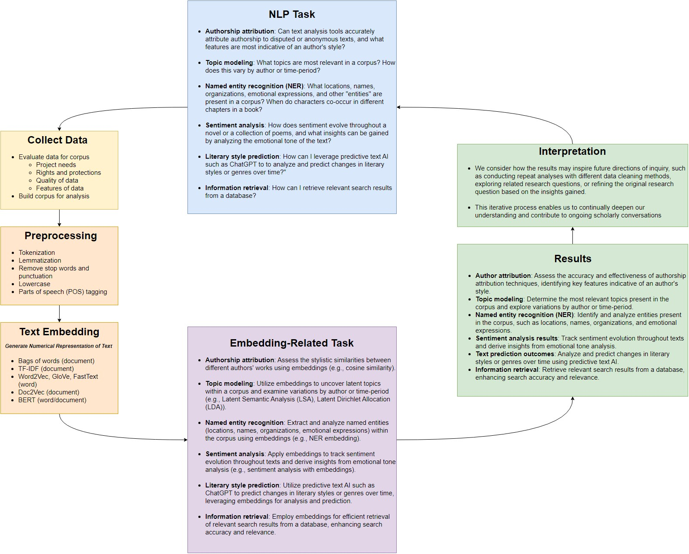
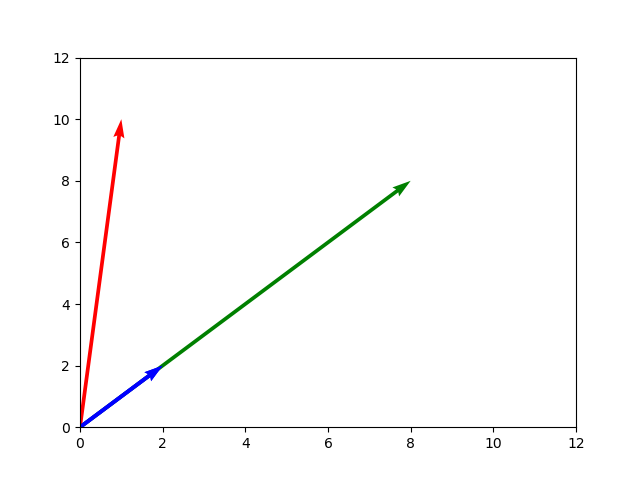

# Vector Space
Now that we've preprocessed our data, let's move to the next step of the interpretative loop: *generating a text embedding*.



Many NLP models make use of a concept called Vector Space. The concept works like this:

1. We create **embeddings**, or mathematical surrogates, of words and documents in vector space. These embeddings can be represented as sets of coordinates in multidimensional space, or as multi-dimensional matrices.
2. These embeddings should be based on some sort of **feature extraction**, meaning that meaningful features from our original documents are somehow represented in our embedding. This will make it so that relationships between embeddings in this vector space will correspond to relationships in the actual documents.

## Bags of Words

In the models we'll look at today, we have a **"bag of words"** assumption as well. We will not consider the placement of words in sentences, their context, or their conjugation into different forms (run vs ran), not until later in this course.

A "bag of words" model is like putting all words from a sentence in a bag and just being concerned with how many of each word you have, not their order or context.

### Worked Example: Bag of Words

Let's suppose we want to model a small, simple set of toy documents. Our entire corpus of documents will only have two words, *to* and *be*. We have four documents, A, B, C and D:

- A: be be be be be be be be be be to
- B: to be to be to be to be to be to be to be to be
- C: to to be be
- D: to be to be

We will start by embedding words using a "one hot" embedding algorithm. Each document is a new row in our table. Every time word 'to' shows up in a document, we add one to our value for the 'to' dimension for that row, and zero to every other dimension. Every time 'be' shows up in our document, we will add one to our value for the 'be' dimension for that row, and zero to every other dimension.

How does this corpus look in vector space? We can display our model using a **document-term matrix**, which looks like the following:

| Document   | to      | be |
| ---------- | ----------- | ----------- |
| Document A | 1 | 10 |
| Document B | 8 | 8 |
| Document C | 2 | 2 |
| Document D | 2 | 2 |

Notice that documents C and D are represented exactly the same. This is unavoidable right now because of our "bag of words" assumption, but much later on we will try to represent positions of words in our models as well. Let's visualize this using Python.

```python
import numpy as np
import matplotlib.pyplot as plt
```

```python
corpus = np.array([[1,10],[8,8],[2,2],[2,2]])
print(corpus)
```

```txt
[[ 1 10]
  [ 8  8]
  [ 2  2]
  [ 2  2]]
```

### Graphing our model

We don't just have to think of our words as columns. We can also think of them as dimensions, and the values as coordinates for each document.

```python
# matplotlib expects a list of values by column, not by row.
# We can simply turn our table on its edge so rows become columns and vice versa.
corpusT = np.transpose(corpus)
print(corpusT)
```

```txt
[[ 1  8  2  2]
  [10  8  2  2]]
```

```python
X = corpusT[0]
Y = corpusT[1]
# define some colors for each point. Since points A and B are the same, we'll have them as the same color.
mycolors = ['r','g','b','b']

# display our visualization
plt.scatter(X,Y, c=mycolors)
plt.xlim(0, 12)
plt.ylim(0, 12)
plt.show()
```


### Distance and Similarity

What can we do with this simple model? At the heart of many research tasks is **distance** or **similarity**, in some sense. When we classify or search for documents, we are asking for documents that are "close to" some known examples or search terms. When we explore the topics in our documents, we are asking for a small set of concepts that capture and help explain as much as the ways our documents might differ from one another. And so on.

There are two measures of distance/similarity we'll consider here: **Euclidean distance** and **cosine similarity**.

#### Euclidean Distance

The Euclidian distance formula makes use of the Pythagorean theorem, where $a^2 + b^2 = c^2$. We can draw a triangle between two points, and calculate the hypotenuse to find the distance. This distance formula works in two dimensions, but can also be generalized over as many dimensions as we want. Let's use distance to compare A to B, C and D. We'll say the closer two points are, the smaller their distance, so the more similar they are.

```python
from sklearn.metrics.pairwise import euclidean_distances as dist

#What is closest to document D?
D = [corpus[3]]
print(D)
```

```txt
[array([2, 2])]
```

```python
dist(corpus, D)
```

```txt
array([[8.06225775],
       [8.48528137],
       [0.        ],
       [0.        ]])
```

Distance may seem like a decent metric at first. Certainly, it makes sense that document D has zero distance from itself. C and D are also similar, which makes sense given our bag of words assumption. But take a closer look at documents B and D. Document B is just document D copy and pasted 4 times! How can it be less similar to document D than document B?

Distance is highly sensitive to document length. Because document A is shorter than document B, it is closer to document D. While distance may be an intuitive measure of similarity, it is actually highly dependent on document length.

We need a different metric that will better represent similarity. This is where vectors come in. Vectors are geometric objects with both length and direction. They can be thought of as a ray or an arrow pointing from one point to another.

Vectors can be added, subtracted, or multiplied together, just like regular numbers can. Our model will consider documents as vectors instead of points, going from the origin at $(0,0)$ to each document. Let's visualize this.

```python
# we need the point of origin in order to draw a vector. Numpy has a function to create an array full of zeroes.
origin = np.zeros([1,4])
print(origin)
```

```txt
[[0. 0. 0. 0.]]
```

```python
# draw our vectors
plt.quiver(origin, origin, X, Y, color=mycolors, angles='xy', scale_units='xy', scale=1)
plt.xlim(0, 12)
plt.ylim(0, 12)
plt.show()
```



Document A and document D are headed in exactly the same direction, which matches our intution that both documents are in some way similar to each other, even though they differ in length.

#### Cosine Similarity

**Cosine Similarity** is a metric which is only concerned with the direction of the vector, not its length. This means the length of a document will no longer factor into our similarity metric. The more similar two vectors are in direction, the closer the cosine similarity score gets to 1. The more orthogonal two vectors get (the more at a right angle they are), the closer it gets to 0. And as the more they point in opposite directions, the closer it gets to -1.

You can think of cosine similarity between vectors as signposts aimed out into multidimensional space. Two similar documents going in the same direction have a high cosine similarity, even if one of them is much further away in that direction.

Now that we know what cosine similarity is, how does this metric compare our documents?

```python
from sklearn.metrics.pairwise import cosine_similarity as cs
cs(corpus, D)
```

```txt
array([[0.7739573],
       [1.       ],
       [1.       ],
       [1.       ]])
```

Both A and D are considered similar by this metric. Cosine similarity is used by many models as a measure of similarity between documents and words.

### Generalizing over more dimensions

If we want to add another word to our model, we can add another dimension, which we can represent as another column in our table. Let's add more documents with new words in them.

- E: be or not be
- F: to be or not to be

| Document | to | be | or | not |
| ---------- | ----------- | ----------- | ----------- | ----------- |
| Document A | 1 | 10 | 0 | 0
| Document B | 8 | 8 | 0 | 0
| Document C | 2 | 2 | 0 | 0
| Document D | 2 | 2 | 0 | 0
| Document E | 0 | 2 | 1 | 1
| Document F | 2 | 2 | 1 | 1

We can keep adding dimensions for however many words we want to add. It's easy to imagine vector space with two or three dimensions, but visualizing this mentally will rapidly become downright impossible as we add more and more words. Vocabularies for natural languages can easily reach tens of thousands of words.

Keep in mind, it's not necessary to visualize how a high dimensional vector space looks. These relationships and formulae work over an arbitrary number of dimensions. Our methods for how to measure similarity will carry over, even if drawing a graph is no longer possible.

```python
# add two new dimensions to our corpus
corpus = np.hstack((corpus, np.zeros((4,2))))
print(corpus)
```

```txt
[[ 1. 10.  0.  0.]
  [ 8.  8.  0.  0.]
  [ 2.  2.  0.  0.]
  [ 2.  2.  0.  0.]]
```

```python
E = np.array([[0,2,1,1]])
F = np.array([[2,2,1,1]])

#add document E to our corpus
corpus = np.vstack((corpus, E))
print(corpus)
```

```txt
[[ 1. 10.  0.  0.]
  [ 8.  8.  0.  0.]
  [ 2.  2.  0.  0.]
  [ 2.  2.  0.  0.]
  [ 0.  2.  1.  1.]]
```

What do you think the most similar document is to document F?

```python
cs(corpus, F)
```

```txt
array([[0.69224845],
        [0.89442719],
        [0.89442719],
        [0.89442719],
        [0.77459667]])
```

This new document seems most similar to the documents B,C and D.

This principle of using vector space will hold up over an arbitrary number of dimensions, and therefore over a vocabulary of arbitrary size.

This is the essence of vector space modeling: documents are embedded as vectors in very high dimensional space.

How we define these dimensions and the methods for feature extraction may change and become more complex, but the essential idea remains the same.

Next, we will discuss TF-IDF, which balances the above "bag of words" approach against the fact that some words are more or less interesting: *whale* conveys more useful information than *the*, for example.
