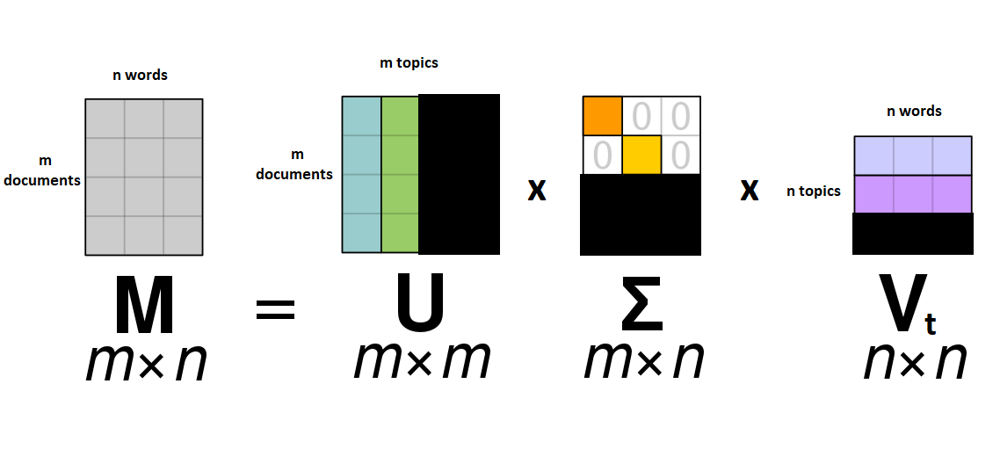

## Topical Modelling
We have already covered a large amount of conceptual ground, but now we are starting to get to models which will help us better understand our corpus.  

Topical modelling is a frequent goal of text analysis. Think of topics as different categories or classes. 
We want to assign a document to one or more classes, depending on its content. 
Sometimes these topics are predefined, such as when we are trying to determine the author of a work. 
Sometimes they are created by the model, and the criteria used by the model to create the topics tells us something about the documents in question.   

There are a variety of ways of doing this- and not all of them use the vector space model we have learned. 
Some are vector space based such as PCA or LSA, others such as LDA are probability based. 
We will be discussing Latent Semantic Analysis, or LSA, because it introduces us to new concepts we will use in the future. 

The assumption behind LSA is that many of these words in our vocabulary have some underlying smaller set of hidden topics that determines their distribution across documents. 
In all our models so far, each dimension has corresponded to a word. In our new LSA model, each dimension now corresponds to hidden underlying concepts. 
These ‘latent semantic’ properties are mathematically derived from our TF-IDF matrix.  

## Preparing to create the LSA model
The first step in LSA is something we already know how to do- we calculate TF-IDF scores for each document. 
This is because our next step gives stronger weights to higher values, so we want the most important words to have high values. 
We will once again use the parsers we created in our preprocessing lesson, reproduced below:
~~~
import glob
import os
from pathlib import Path
def create_file_list(directory, filter_str='*'):
    #find files matching certain pattern. if no pattern, use star.
    files = Path(directory).glob(filter_str)
	#create an array of file paths as strings.
    files_to_analyze = []
    for f in files:
        files_to_analyze.append(str(f))
    return files_to_analyze
	
class Our_Tokenizer:
    def __init__(self):
        #import spacy tokenizer/language model
        self.nlp = en_core_web_sm.load()
        self.nlp.max_length = 4500000 # increase max number of characters that spacy can process (default = 1,000,000)
	def tokenize(self, document):
		tokens = self.nlp(document)
		#TODO: add all names to stop list.
		
        tokens = [token.lemma_ for token in tokens if (
            token.is_stop == False and # filter out stop words
            token.is_punct == False and # filter out punct
            token.is_space == False and #filter newlines
            token.pos_ != 'PROPN')] #remove all proper nouns such as names
		return tokens

corpus_dir = 'C:\\Users\\Desktop\\documents\\'
corpus_file_list = create_file_list(corpus_dir)
~~~
{: .language-python}

We will create the TF-IDF model using the same scikit learn library from the TF-IDF lesson as well. Let's also check the size of our term document matrix.
~~~
tfidf = TfidfVectorizer(input = 'filename', tokenizer = our_tok.tokenize, encoding='latin-1')
train_data = tfidf.fit_transform(files_to_analyze)
train_data.shape
~~~
{: .language-python}
~~~
(41, 42254)
~~~
{: .output}

What do these dimensions mean? We have 41 documents, which we can think of as rows. And we have 42254 tokens, which is like a dictionary of all the types of words we have in our documents, and which we represent as columns.

Now we want to reduce the number of dimensions used to represent our documents. Linear algebra has a technique to reduce the number of dimensions called Singular Value Decomposition. 
We won’t deeply dive into all the mathematics but will discuss what happens in abstract.

We've seen our documents represented both in vector space and also in a matrix.
In a term-document matrix, each document is a row and each word is a column.

Singular Value Decomposition is easier to understand what is happening by representing our terms and documents as a matrix instead. IT can be represented in vector space as well, but it is less intuitive.
The mathematical technique we are using is called “Singular Value Decomposition” because we are ‘decomposing’ our original matrix and creating a special matrix with “singular values.” 

It’s a proven fact that any matrix M of arbitrary size can always be split or decomposed into three matrices that multiply together to make M. There are often many non-unique ways to do this decomposition. 
The three resulting matrices are called U, Σ, and Vt.

The U matrix is a matrix where there are documents as rows, and different topics as columns. The scores in each cell show how much each document is ‘about’ each topic.  
The Vt matrix is a matrix where there are a set of terms as columns, and different topics as rows. Again, the values in each cell correspond to how much a given word indicates a given topic. 
The Σ matrix is special, and the one from which SVD gets its name. Nearly every cell in the matrix is zero.
Only the diagonal cells are filled in- there are singular values in each row and column. Each singular value represent the amount of variation in our data explained by each topic.
A good deal of variation can often be explained by a relatively small number of topics, and often variation each topic describes shrinks with each new topic. 
Because of this, we can truncate or remove individual rows with the lowest singular values, since they are less important. 
Once this truncation happens, we can multiply together our three matrices and end up with a smaller matrix with topics instead of words as dimensions.

Question: What's the most possible topics we could get from this model? Think about what the most singular values are that you could possibly fit in the Σ matrix.

Remember, these singular values exist only on the diagonal, so the most topics we could have will be whichever we have fewer of- unique words or documents in our corpus.
Because there are usually more unique words than there are documents, it will almost always be equal to the number of documents we have, in this case 41.

~~~
#sklearn version of SVD. We specify a random state so that all of our results are the same.
#We're going to start with a lot of topics and truncate
topicCount = len(train_data)
testsvdmodel= TruncatedSVD(n_components= topicCount, random_state= 300)
#train model on our corpus
testlsa= testsvdmodel.fit_transform(train_data)
~~~
{: .language-python}

Now, we have a set of 41 topics. But having a topic for every document isn't terribly useful, so we want to truncate this matrix, or remove some of the topics that don't explain much data.
How should we pick a number of topics to keep? Fortunately, we have the Singular Values to help us understand how much data each topic explains.
Let's take a look and see how much data each topic explains. We will visualize it on a graph.

~~~
import matplotlib.pyplot as plt

#this shows us the amount of dropoff in explanation we have in our sigma matrix. 
print(testsvdmodel.explained_variance_ratio_)

plt.plot(range(topicCount), testsvdmodel.explained_variance_ratio_)
plt.xlabel("Topic Number")
plt.ylabel("% explained")
plt.title("SVD dropoff")
plt.show()  # show first chart
~~~
{: .language-python}

Often a heuristic used by researchers to determine a topic count is to look at the dropoff in percentage of data explained by each topic. 
Typically the rate of data explained will be high at first, dropoff quickly and then start to level out. 
We want to pick a point on the 'elbow' where it goes from a high level of explanation to where it starts levelling out and not explaining as much per topic
This is often a good sweet spot between overfitting our model and not having enough topics.
Alternatively, we could set some target sum for how much of our data we want our topics to explain, something like 90% or 95%. 
With a small dataset like this, that would result in a large number of topics, so we'll pick an elbow instead.

Looking at our model, a good number in the middle of the 'elbow' appears to be around 5-6 topics.
Let's fit a model using only 6 topics and then take a look at what each topic looks like.

~~~
topicCount = 6
svdmodel= TruncatedSVD(n_components= topicCount, random_state= 300)
lsa= svdmodel.fit_transform(train_data)

print(corpus_file_list)
#create set of topic labels for each document
labels = []
for doc in lsa:
    #We'll say each document belongs to the dimension where it has the highest value
    #this is not the only way to do clustering. 
    index_min = np.argmax(doc)
    #print(index_min)
    labels.append(index_min)
print(labels)
~~~
{: .language-python}

These topics are not labelled, so one thing we may want to do is view the most important words for a given topic. 
Sometimes it’s possible to spot certain semantic themes based on the most impactful words, other times the connections are more obscure. 
~~~
#print out the top words for each topic.
def showTopics(testsvdmodel, word_count):
    topwords = []
    for index, component in enumerate(testsvdmodel.components_):
        #create a structure where words and dimensions are sortable
        zipped = zip(terms, component)
        #sort by words with highest weights.
        top_terms_key=sorted(zipped, key = lambda t: t[1], reverse=True)[:word_count]
        top_terms_list=list(dict(top_terms_key).keys())
        topwords.append("Topic "+str(index)+": "+str(top_terms_list))
    return topwords
topwords= showTopics(testsvdmodel, word_count)

for topic in topwords:
    print(topic)

~~~
{: .language-python}

Do any words seem particularly evokative, interesting or descriptive?
Are there certain topics you think could be labelled according to some theme or common semantic idea? Are there certain topics where the semantic concept is less clear?
Each document belongs to different topics in different amounts. Which topics do you think our documents most strongly belong to?
~~~
#create set of topic labels for each document and print them all out
labels = []
for doc in lsa:
    #We'll say each document belongs to the dimension where it has the highest value
    #this is NOT the only way to do clustering. 
    index_min = np.argmax(doc)
    #print(index_min)
    labels.append(index_min)

#now print all of them
for i in range(len(labels)):
    print("Document: "+files_to_analyze[i])
    topicnum = labels[i]
    print(topwords[topicnum])

~~~
{: .language-python}

~~~
Document: C:\Users\holten\OneDrive - UWM\Desktop\documents\austen-emma.txt
Topic 0: ['say', 'mr', 'man', 'know', 'come', 'look', 'like', 'think', 'go', 'time', 'good', 'little', 'mrs', 'hand', 'old', 'see', 'great', 'day', 'sir', 'long']
Document: C:\Users\holten\OneDrive - UWM\Desktop\documents\austen-ladysusan.txt
Topic 0: ['say', 'mr', 'man', 'know', 'come', 'look', 'like', 'think', 'go', 'time', 'good', 'little', 'mrs', 'hand', 'old', 'see', 'great', 'day', 'sir', 'long']
Document: C:\Users\holten\OneDrive - UWM\Desktop\documents\austen-northanger.txt
Topic 0: ['say', 'mr', 'man', 'know', 'come', 'look', 'like', 'think', 'go', 'time', 'good', 'little', 'mrs', 'hand', 'old', 'see', 'great', 'day', 'sir', 'long']
Document: C:\Users\holten\OneDrive - UWM\Desktop\documents\austen-persuasion.txt
Topic 0: ['say', 'mr', 'man', 'know', 'come', 'look', 'like', 'think', 'go', 'time', 'good', 'little', 'mrs', 'hand', 'old', 'see', 'great', 'day', 'sir', 'long']
Document: C:\Users\holten\OneDrive - UWM\Desktop\documents\austen-pride.txt
Topic 0: ['say', 'mr', 'man', 'know', 'come', 'look', 'like', 'think', 'go', 'time', 'good', 'little', 'mrs', 'hand', 'old', 'see', 'great', 'day', 'sir', 'long']
Document: C:\Users\holten\OneDrive - UWM\Desktop\documents\austen-sense.txt
Topic 0: ['say', 'mr', 'man', 'know', 'come', 'look', 'like', 'think', 'go', 'time', 'good', 'little', 'mrs', 'hand', 'old', 'see', 'great', 'day', 'sir', 'long']
Document: C:\Users\holten\OneDrive - UWM\Desktop\documents\chesterton-ball.txt
Topic 0: ['say', 'mr', 'man', 'know', 'come', 'look', 'like', 'think', 'go', 'time', 'good', 'little', 'mrs', 'hand', 'old', 'see', 'great', 'day', 'sir', 'long']
Document: C:\Users\holten\OneDrive - UWM\Desktop\documents\chesterton-brown.txt
Topic 0: ['say', 'mr', 'man', 'know', 'come', 'look', 'like', 'think', 'go', 'time', 'good', 'little', 'mrs', 'hand', 'old', 'see', 'great', 'day', 'sir', 'long']
Document: C:\Users\holten\OneDrive - UWM\Desktop\documents\chesterton-knewtoomuch.txt
Topic 0: ['say', 'mr', 'man', 'know', 'come', 'look', 'like', 'think', 'go', 'time', 'good', 'little', 'mrs', 'hand', 'old', 'see', 'great', 'day', 'sir', 'long']
Document: C:\Users\holten\OneDrive - UWM\Desktop\documents\chesterton-napoleon.txt
Topic 0: ['say', 'mr', 'man', 'know', 'come', 'look', 'like', 'think', 'go', 'time', 'good', 'little', 'mrs', 'hand', 'old', 'see', 'great', 'day', 'sir', 'long']
Document: C:\Users\holten\OneDrive - UWM\Desktop\documents\chesterton-thursday.txt
Topic 0: ['say', 'mr', 'man', 'know', 'come', 'look', 'like', 'think', 'go', 'time', 'good', 'little', 'mrs', 'hand', 'old', 'see', 'great', 'day', 'sir', 'long']
Document: C:\Users\holten\OneDrive - UWM\Desktop\documents\chesterton-whitehorse.txt
Topic 0: ['say', 'mr', 'man', 'know', 'come', 'look', 'like', 'think', 'go', 'time', 'good', 'little', 'mrs', 'hand', 'old', 'see', 'great', 'day', 'sir', 'long']
Document: C:\Users\holten\OneDrive - UWM\Desktop\documents\dickens-bleakhouse.txt
Topic 0: ['say', 'mr', 'man', 'know', 'come', 'look', 'like', 'think', 'go', 'time', 'good', 'little', 'mrs', 'hand', 'old', 'see', 'great', 'day', 'sir', 'long']
Document: C:\Users\holten\OneDrive - UWM\Desktop\documents\dickens-christmascarol.txt
Topic 0: ['say', 'mr', 'man', 'know', 'come', 'look', 'like', 'think', 'go', 'time', 'good', 'little', 'mrs', 'hand', 'old', 'see', 'great', 'day', 'sir', 'long']
Document: C:\Users\holten\OneDrive - UWM\Desktop\documents\dickens-davidcopperfield.txt
Topic 0: ['say', 'mr', 'man', 'know', 'come', 'look', 'like', 'think', 'go', 'time', 'good', 'little', 'mrs', 'hand', 'old', 'see', 'great', 'day', 'sir', 'long']
Document: C:\Users\holten\OneDrive - UWM\Desktop\documents\dickens-greatexpectations.txt
Topic 0: ['say', 'mr', 'man', 'know', 'come', 'look', 'like', 'think', 'go', 'time', 'good', 'little', 'mrs', 'hand', 'old', 'see', 'great', 'day', 'sir', 'long']
Document: C:\Users\holten\OneDrive - UWM\Desktop\documents\dickens-hardtimes.txt
Topic 0: ['say', 'mr', 'man', 'know', 'come', 'look', 'like', 'think', 'go', 'time', 'good', 'little', 'mrs', 'hand', 'old', 'see', 'great', 'day', 'sir', 'long']
Document: C:\Users\holten\OneDrive - UWM\Desktop\documents\dickens-olivertwist.txt
Topic 0: ['say', 'mr', 'man', 'know', 'come', 'look', 'like', 'think', 'go', 'time', 'good', 'little', 'mrs', 'hand', 'old', 'see', 'great', 'day', 'sir', 'long']
Document: C:\Users\holten\OneDrive - UWM\Desktop\documents\dickens-ourmutualfriend.txt
Topic 0: ['say', 'mr', 'man', 'know', 'come', 'look', 'like', 'think', 'go', 'time', 'good', 'little', 'mrs', 'hand', 'old', 'see', 'great', 'day', 'sir', 'long']
Document: C:\Users\holten\OneDrive - UWM\Desktop\documents\dickens-pickwickpapers.txt
Topic 0: ['say', 'mr', 'man', 'know', 'come', 'look', 'like', 'think', 'go', 'time', 'good', 'little', 'mrs', 'hand', 'old', 'see', 'great', 'day', 'sir', 'long']
Document: C:\Users\holten\OneDrive - UWM\Desktop\documents\dickens-taleoftwocities.txt
Topic 0: ['say', 'mr', 'man', 'know', 'come', 'look', 'like', 'think', 'go', 'time', 'good', 'little', 'mrs', 'hand', 'old', 'see', 'great', 'day', 'sir', 'long']
Document: C:\Users\holten\OneDrive - UWM\Desktop\documents\dumas-blacktulip.txt
Topic 0: ['say', 'mr', 'man', 'know', 'come', 'look', 'like', 'think', 'go', 'time', 'good', 'little', 'mrs', 'hand', 'old', 'see', 'great', 'day', 'sir', 'long']
Document: C:\Users\holten\OneDrive - UWM\Desktop\documents\dumas-maninironmask.txt
Topic 1: ['d’artagnan', 'aramis', 'athos', 'porthos', 'monsieur', 'de', 'fouquet', 'king', 'madame', 'raoul', 'm.', 'say', 'milady', 'cardinal', 'musketeer', 'man', 'guiche', 'mazarin', 'monseigneur', 'la']
Document: C:\Users\holten\OneDrive - UWM\Desktop\documents\dumas-montecristo.txt
Topic 0: ['say', 'mr', 'man', 'know', 'come', 'look', 'like', 'think', 'go', 'time', 'good', 'little', 'mrs', 'hand', 'old', 'see', 'great', 'day', 'sir', 'long']
Document: C:\Users\holten\OneDrive - UWM\Desktop\documents\dumas-tenyearslater.txt
Topic 0: ['say', 'mr', 'man', 'know', 'come', 'look', 'like', 'think', 'go', 'time', 'good', 'little', 'mrs', 'hand', 'old', 'see', 'great', 'day', 'sir', 'long']
Document: C:\Users\holten\OneDrive - UWM\Desktop\documents\dumas-threemusketeers.txt
Topic 1: ['d’artagnan', 'aramis', 'athos', 'porthos', 'monsieur', 'de', 'fouquet', 'king', 'madame', 'raoul', 'm.', 'say', 'milady', 'cardinal', 'musketeer', 'man', 'guiche', 'mazarin', 'monseigneur', 'la']
Document: C:\Users\holten\OneDrive - UWM\Desktop\documents\dumas-twentyyearsafter.txt
Topic 1: ['d’artagnan', 'aramis', 'athos', 'porthos', 'monsieur', 'de', 'fouquet', 'king', 'madame', 'raoul', 'm.', 'say', 'milady', 'cardinal', 'musketeer', 'man', 'guiche', 'mazarin', 'monseigneur', 'la']
Document: C:\Users\holten\OneDrive - UWM\Desktop\documents\melville-bartleby.txt
Topic 5: ['bartleby', 'mr', 'nipper', 'turkey', 'scrivener', 'say', 'boffin', 'sir', 'sam', 'lear', 'ginger', 'babo', 'negro', 'prefer', 'office', 'oliver', 'thou', 'weller', 'olivia', 'isle']
Document: C:\Users\holten\OneDrive - UWM\Desktop\documents\melville-conman.txt
Topic 0: ['say', 'mr', 'man', 'know', 'come', 'look', 'like', 'think', 'go', 'time', 'good', 'little', 'mrs', 'hand', 'old', 'see', 'great', 'day', 'sir', 'long']
Document: C:\Users\holten\OneDrive - UWM\Desktop\documents\melville-moby_dick.txt
Topic 0: ['say', 'mr', 'man', 'know', 'come', 'look', 'like', 'think', 'go', 'time', 'good', 'little', 'mrs', 'hand', 'old', 'see', 'great', 'day', 'sir', 'long']
Document: C:\Users\holten\OneDrive - UWM\Desktop\documents\melville-omoo.txt
Topic 0: ['say', 'mr', 'man', 'know', 'come', 'look', 'like', 'think', 'go', 'time', 'good', 'little', 'mrs', 'hand', 'old', 'see', 'great', 'day', 'sir', 'long']
Document: C:\Users\holten\OneDrive - UWM\Desktop\documents\melville-piazzatales.txt
Topic 0: ['say', 'mr', 'man', 'know', 'come', 'look', 'like', 'think', 'go', 'time', 'good', 'little', 'mrs', 'hand', 'old', 'see', 'great', 'day', 'sir', 'long']
Document: C:\Users\holten\OneDrive - UWM\Desktop\documents\melville-pierre.txt
Topic 0: ['say', 'mr', 'man', 'know', 'come', 'look', 'like', 'think', 'go', 'time', 'good', 'little', 'mrs', 'hand', 'old', 'see', 'great', 'day', 'sir', 'long']
Document: C:\Users\holten\OneDrive - UWM\Desktop\documents\melville-typee.txt
Topic 0: ['say', 'mr', 'man', 'know', 'come', 'look', 'like', 'think', 'go', 'time', 'good', 'little', 'mrs', 'hand', 'old', 'see', 'great', 'day', 'sir', 'long']
Document: C:\Users\holten\OneDrive - UWM\Desktop\documents\shakespeare-caesar.txt
Topic 3: ['thou', 'romeo', 'lear', 'thee', 'thy', 'o', 'olivia', 'love', 'sir', 'iago', 'hermia', 'viola', 'hath', 'capulet', 'benedick', 'brutus', 'demetrius', 'leonato', 'shall', 'toby']
Document: C:\Users\holten\OneDrive - UWM\Desktop\documents\shakespeare-lear.txt
Topic 3: ['thou', 'romeo', 'lear', 'thee', 'thy', 'o', 'olivia', 'love', 'sir', 'iago', 'hermia', 'viola', 'hath', 'capulet', 'benedick', 'brutus', 'demetrius', 'leonato', 'shall', 'toby']
Document: C:\Users\holten\OneDrive - UWM\Desktop\documents\shakespeare-midsummer.txt
Topic 3: ['thou', 'romeo', 'lear', 'thee', 'thy', 'o', 'olivia', 'love', 'sir', 'iago', 'hermia', 'viola', 'hath', 'capulet', 'benedick', 'brutus', 'demetrius', 'leonato', 'shall', 'toby']
Document: C:\Users\holten\OneDrive - UWM\Desktop\documents\shakespeare-muchado.txt
Topic 3: ['thou', 'romeo', 'lear', 'thee', 'thy', 'o', 'olivia', 'love', 'sir', 'iago', 'hermia', 'viola', 'hath', 'capulet', 'benedick', 'brutus', 'demetrius', 'leonato', 'shall', 'toby']
Document: C:\Users\holten\OneDrive - UWM\Desktop\documents\shakespeare-othello.txt
Topic 3: ['thou', 'romeo', 'lear', 'thee', 'thy', 'o', 'olivia', 'love', 'sir', 'iago', 'hermia', 'viola', 'hath', 'capulet', 'benedick', 'brutus', 'demetrius', 'leonato', 'shall', 'toby']
Document: C:\Users\holten\OneDrive - UWM\Desktop\documents\shakespeare-romeo.txt
Topic 3: ['thou', 'romeo', 'lear', 'thee', 'thy', 'o', 'olivia', 'love', 'sir', 'iago', 'hermia', 'viola', 'hath', 'capulet', 'benedick', 'brutus', 'demetrius', 'leonato', 'shall', 'toby']
Document: C:\Users\holten\OneDrive - UWM\Desktop\documents\shakespeare-twelfthnight.txt
Topic 3: ['thou', 'romeo', 'lear', 'thee', 'thy', 'o', 'olivia', 'love', 'sir', 'iago', 'hermia', 'viola', 'hath', 'capulet', 'benedick', 'brutus', 'demetrius', 'leonato', 'shall', 'toby']

~~~
{: .output}

Another interesting thing we might do is visualize the relationships between documents. Let's plot our documents on a graph. 

~~~
imglsa= TruncatedSVD(n_components= 2, random_state= 300)
dtm_lsa = imglsa.fit_transform(train_data)

##MATPLOTLIB FOR GRAPHING
import matplotlib.pyplot as plt
from matplotlib.colors import LinearSegmentedColormap as colormap

#first 'topic' is x axis, second 'topic' is y axis
x = [w[0] for w in dtm_lsa]
y = [w[1] for w in dtm_lsa]
#graph = plt.scatter(x, y, c=labels)
#define colors if you want to- can also pass in a bunch of integers and let matplotlib pick your colors if so desired.
colors = ['black', 'lightgrey', 'brown', 'red', 'orange', 'gold',
          'yellow', 'green', 'lime', 'cyan', 'blue',
          'violet', 'hotpink']
cm = colormap.from_list('cm', colors)
graph = plt.scatter(x, y, c=labels, cmap=cm)

# produce a legend with the unique colors from the scatter
legend= plt.legend(*graph.legend_elements(), loc="upper right", title="classes")
plt.show()
~~~
{: .python}

Can we draw any conclusions about how documents are distributed on this graph?

##Conclusion 

Latent Semantic Analysis is one way of doing topical analysis that uses many of the tools we have learned about so far. 

LSA is a conceptual leap for document representation. Dimensions in our model no longer cleanly represent a single word, or even a weighted value for words like with TF-IDF. 
Instead, a dimension represents some semantic combination of words and weights, one that we hope corresponds to underlying meaning. 
Sometimes underlying concepts are clear, other times they are more obscure, but what goes into each dimension is explicitly stated. 
However, many other models have semantic dimensions that take many more things into account and are not as easy to interpret. 

Next, we will explore more embedding techniques that use machine learning to determine how words are represented in vector space. 
