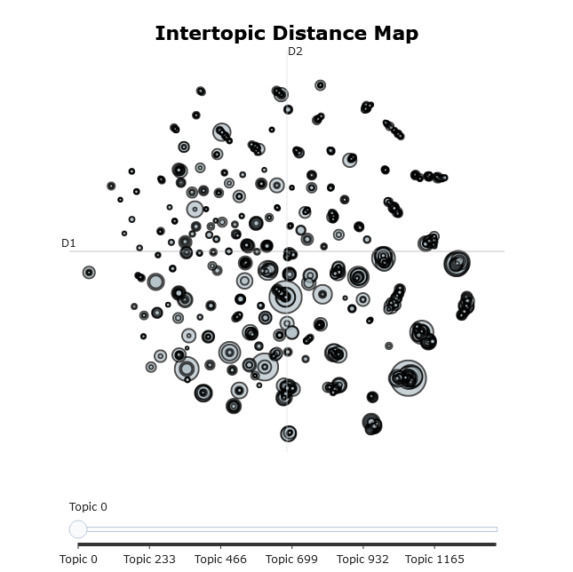
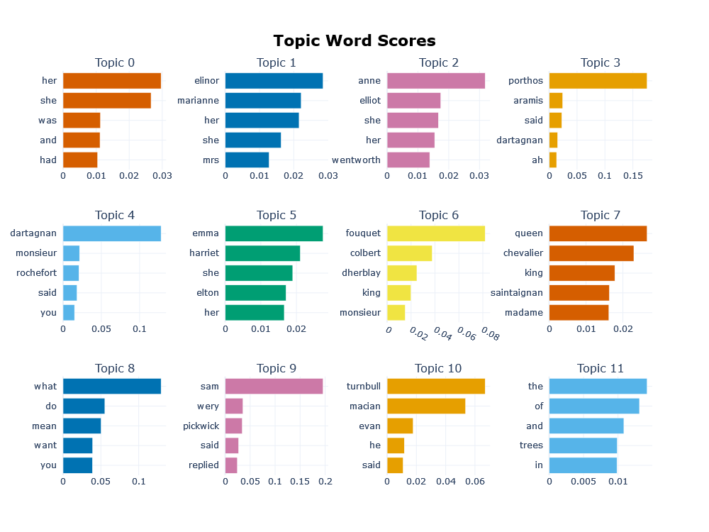
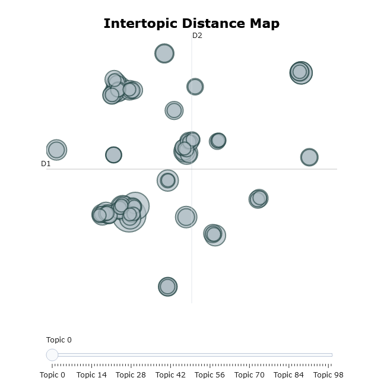

In 2017, a revolutionary natural language model called BERT (Bidirectional Encoder Representations from Transformers) was published.
The key component of this model called "Transformers" proved influential and is utilized in current state of the art models for many natural language tasks.

BERT utilized embedding algorithms but also a new component called "transformers."
This was a machine learning model that accounted for the relative positions of each word within a text and their relationships to each other.
Words from anywhere in the document could now influence the embeddings of other words, rather than just in a specific window.
This also meant that word embeddings were not universal, so a word such as "duck" would have different embeddings depending on the other words in the document and their positions.
The model also made use of very little preprocessing, meaning tasks like lemmatizing and lower-casing were not required.

The embedding mechanism is more complex than the ones we've looked at, and we will only discuss an overview of what is occurring.

First, input embeddings are calculated using an embedding algorithm such as word2vec, and then values for the position of the token in the text are added to the embeddings.
Next, these values are passed to a stack of "encoders". There is an encoder for each token in our input documents.
Each encoder processes the input it gets from the previous encoder and the word embedding for one token.
The encoder runs something called a "self-attention" calculation. It then runs a "feed forward" operation that passes the results forward to the next encoder.

Once all the encoders have processed the document, the matrices generated by our encoders are passed on to a second stack of "decoders."
A "decoder" takes as input the output from all encoders and the previous decoder in the stack. It also runs a "self-attention" calculation and feeds forward the results the next decoder in the stack.
The final output of the decoder stack is some matrix of values. This is converted into a set of probabilities, which correspond to whatever task we would like to achieve.
For something like predicting the next word, the probability score would be the odds of each word in our vocabulary. For something like translation, it would be words in our target language.
This final step can vary so the model can be used for many natural language tasks such as automatic translation, word prediction, question answering, and parts of speech tagging.

BERTopic is a 2022 topic modelling algorithm that makes use of the embeddings trained by BERT.
It uses BERT for embedding documents into multi-dimensional space.
Next, it uses a dimensional reduction technique called UMAP and a clustering technique known as HDBSCAN. Finally, it returns a list of topics.

First, let's create a set of documents for this to analyze. Since it requires a large number of documents, we'll break each paragraph in our corpus up into a seperate "document."
We'll use Google Colab for this lesson since the visualization component requires a Jupyter Notebook.

https://colab.research.google.com/drive/1hBMfaTlV3LNlWCo7xqYh-p_aPT2TPUq2

~~~
import glob
import os
from google.colab import drive
from pathlib import Path
drive.mount('/content/drive')

def create_file_list(directory, filter_str='*'):
    # iterate over files in directory
    files_to_analyze = []
    #find files matching certain pattern. if no pattern, use star.
    files = Path(directory).glob(filter_str)
    for f in files:
        files_to_analyze.append(str(f))
    return files_to_analyze

files_to_analyze = create_file_list("/content/drive/MyDrive/gutenberg")
~~~

Next, we'll split our documents into a set of paragraph sized chunks, since BERTopic requires a large number of documents to work.

~~~
docs = []
for f in files_to_analyze:
  with open(f, 'r', encoding="utf-8") as file:
    text= file.read()
    #too few documents and this doesn't work. We break each paragraph into a document.
    result = list(filter(lambda x : x != '', text.split('\n\n')))
    for d in result:
      docs.append(d)
~~~

Now we can train the model. Calculating the probabilities takes a very long time so we will disable it for this lesson.
~~~
from bertopic import BERTopic
topic_model = BERTopic(language="english", calculate_probabilities=False, verbose=True)
topics, probs = topic_model.fit_transform(docs)
~~~

Once trained, we can view the topics using the visualization tool included with BERTopic.

~~~
topic_model.visualize_topics()
~~~

This gives us a huge number of topics. Fortunately, we can zoom in by highlighting a particular section. We can also look at a hierarchy of topics which will help us better understand how these topics are related. Let's list the top 10 topics.

~~~
freq = topic_model.get_topic_info(); freq.head(10)
~~~

Next, we'll select a common topic and see what words weigh most heavily.

~~~
topic_model.get_topic(4)  
~~~
~~~
[('trees', 0.00444068224067004),
 ('cocoanut', 0.0031398497719925572),
 ('green', 0.0030217376615679636),
 ('sky', 0.00269663489398048),
 ('sun', 0.0024358608734699524),
 ('valley', 0.0023602349387467883),
 ('leaves', 0.0022882627448566617),
 ('tree', 0.0021350043908938627),
 ('fruit', 0.0018746731879962855),
 ('moon', 0.001828283583366602)]
 ~~~

We can also create a chart with topics and their weights.
~~~
topic_model.visualize_barchart(top_n_topics=12)
~~~

We can view a hierarchy of topics to see how different topics would be combined if we reduced the number of topics.

~~~
topic_model.visualize_hierarchy(top_n_topics=100)
~~~

We can reduce the number of topics. Once reduced, we can still do the functions listed above.

~~~
topic_model.reduce_topics(docs, nr_topics=100)
topic_model.visualize_topics()
~~~

We can also find the most similar topic for a given topic. Let's try doing a search for the word "ship"

~~~
similar_topics, similarity = topic_model.find_topics("ship", top_n=5); similar_topics
~~~
~~~
[68, 16, 24, 74, 58]
~~~

The top 5 most related topics are returned. We can look at one of them using the get_topic method from before.

~~~
topic_model.get_topic(68)  
~~~
~~~
[('captain', 0.03795160826733547),
 ('sailor', 0.036659352616111925),
 ('sea', 0.016736695347696322),
 ('boat', 0.01546851526939565),
 ('you', 0.01342783280821039),
 ('sail', 0.01231511268692368),
 ('ship', 0.01170558852979936),
 ('sinbad', 0.011624557172724445),
 ('board', 0.010385872540850485),
 ('said', 0.010336756543549224)]
 ~~~

Finally, we can save and load this model for later use if we want.

~~~
# Save model
topic_model.save("bert_gutenberg_model")
# Load model
my_model = BERTopic.load("bert_gutenberg_model")
~~~

In summary, transformers are a natural language machine learning tool that have proven highly successful at a variety of tasks. We learned how they operate and used a software library called BERTopic to conduct topical modelling using embeddings created from transformers.
