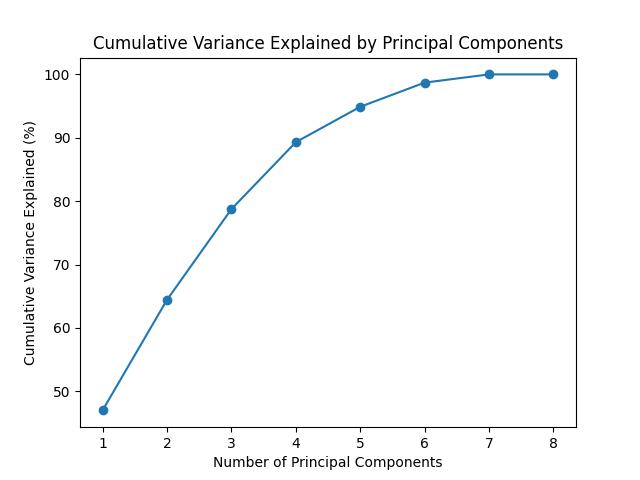

## Load pre-trained model via Gensim
First, load the Word2Vec embedding model. The Word2Vec model takes 3-10 minutes to load. 

We'll be using the Gensim library. The Gensim library comes with several word embedding models including Word2Vec, GloVe, and fastText. We'll start by exploring one of the pre-trained Word2Vec models. We'll discuss the other options later in this lesson.

If you can't get the below word2vec model to load quickly enough, you can use the GloVe model, instead. The GloVe model produces word embeddings that are often very similar to Word2Vec. GloVe can be loaded with:```wv = api.load('glove-wiki-gigaword-50')```

```python
# RUN BEFORE INTRO LECTURE :)

# api to load word2vec models
import gensim.downloader as api

# takes 3-10 minutes to load
wv = api.load('word2vec-google-news-300') # takes 3-10 minutes to load 
```

## Document/Corpus Embeddings Recap

So far, we’ve seen how word counts (bag of words), TF-IDF, and LSA can help us embed a document or set of documents into useful vector spaces that allow us to gain insights from text data. Let's review the embeddings covered thus far...
* **Word count embeddings**: Word count embeddings are a simple yet powerful method that represent text data as a sparse vector where each dimension corresponds to a unique word in the vocabulary, and the value in each dimension indicates the frequency of that word in the document. This approach disregards word order and context, treating each document as an unordered collection of words or tokens.
  
* **TF-IDF embeddings:** Term Frequency Inverse Document Frequency (TF-IDF) is a fancier word-count method. It emphasizes words that are both frequent within a specific document *and* rare across the entire corpus.

* **LSA embeddings:** Latent Semantic Analysis (LSA) is used to find the hidden topics represented by a group of documents. It involves running singular-value decomposition (SVD) on a document-term matrix (typically the TF-IDF matrix), producing a vector representation of each document. This vector scores each document's representation in different topic/concept areas which are derived based on word co-occurences (e.g., 45% topic A, 35% topic B, and 20% topic C). Importantly, LSA is considered a *bag of words* method since the order of words in a document is not considered.

To get a high-level overview of the embedding methods covered thus far, study the table below:

| Technique               | Input                                      | Embedding Structure           | Output Vector Dimensions              | Meaning Stored                       | Order Dependency           |
|:------------------------------:|:--------------------------------------------:|:----------------------:|:------------------------------------------:|:---------------------------------------:|:-----------------------:|
| Word Counts            | Raw text corpus                            | Sparse vectors           | [1, Vocabulary Size] <br>(per document) | Word presence in documents          | No <br>(bag of words)        |
| TF-IDF  | Word Counts     | Sparse vectors           | [1, Vocabulary Size] <br>(per document) | Importance of terms in documents     | No <br>(bag of words)        |
| Latent Semantic Analysis (LSA) | TF-IDF or similar | Dense vectors            | [1, Number of Topics] <br>(per document) | Semantic topics present in documents | No <br>(bag of words)        |

### Bag of Words limitations
In all of these emebdding methods, notice how the order of words in sentences does not matter. We are simply tossing all words in a corpus into a bag ("bag of words") and attempting to glean insights from this bag of words. While such an approach can be effective for revealing broad topics/concepts from text, additional features of language may be revealed by zooming in on the context in which words appear throughout a text. 

For instance, maybe our bag of words contains the following: "cook", "I", "family", "my", "to", "dinner", "love", and "for". Depending on how these words are arranged, the meaning conveyed will change drastically! 
* *I love to cook dinner for my family.*
* *I love to cook family for my dinner.*

### Distributional hypothesis: extracting more meaningful representations of text 
To clarify whether our text is about a nice wholesome family or a cannibal on the loose, we need to include context in our embeddings. As the famous linguist JR Firth once said, “You shall know a word by the company it keeps.” Firth is referring to the *distributional hypothesis*, which states that words that repeatedly occur in similar contexts probably have similar meanings. While the LSA methodology is inspired by the distributional hypothesis, LSA ignores the context of words as they appear in sentences and only pays attention to global word co-occurence patterns across large chunks of texts. If we want to truly know a word based on the company it keeps, we'll need to take into account how some words are more likely to appear before/after other words in a sentence. We'll explore how one of the most famous embedding models, Word2Vec, does this in this episode.

## Word embeddings with Word2Vec
Word2vec is a famous *word embedding* method that was created and published in the ancient year of 2013 by a team of researchers led by Tomas Mikolov at Google over two papers, [[1](https://arxiv.org/abs/1301.3781), [2](https://arxiv.org/abs/1310.4546)]. Unlike with TF-IDF and LSA, which are typically used to produce document and corpus embeddings, Word2Vec focuses on producing a single embedding for every word encountered in a corpus. These embeddings, which are represented as high-dimesional vectors, tend to look very similar for words that are used in similar contexts. Adding this method to our overview table, we get:

| Technique               | Input                                      | Embedding Structure           | Output Vector Dimensions              | Meaning Stored                       | Order Dependency           |
|:------------------------------:|:--------------------------------------------:|:----------------------:|:------------------------------------------:|:---------------------------------------:|:-----------------------:|
| Word Counts             | Raw text corpus                            | Sparse vectors           | [1, Vocabulary Size] <br>(per document) | Word presence in documents          | No <br>(bag of words)        |
| TF-IDF  | Word Counts     | Sparse vectors           | [1, Vocabulary Size] <br>(per document) | Importance of terms in documents     | No <br>(bag of words)        |
| Latent Semantic Analysis (LSA) | TF-IDF or similar | Dense vectors            | [1, Number of Topics] <br>(per document) | Semantic topics present in documents | No <br>(bag of words)        |
| Word2Vec                | Raw text corpus                            | Dense vectors            | [1, Embedding Dimension] <br>(per word)  | Semantic meaning of words            | Yes <br>(word order)     |

The next *supplemental* episode unpacks the technology behind Word2Vec — neural networks. In the interest of time, we will only cover the key concepts and intuition. Please consider studying the next episode if you are interested in learning more about the fascinating world of neural networks and how they actually work. For now, it is sufficient to be aware of few key insights.

### 1. Neural networks have an exceptional ability to learn functions that can map a set of input features to some output.
Because of this general capability, they can be used for a wide assortment of tasks including…
* Predicting the weather tomorrow given historical weather patterns
* Classifying if an email is spam or not
* Classifying if an image contains a person or not
* Predicting a person’s weight based on their height, age, location, etc.
* Predicting commute times given traffic conditions
* Predicting house prices given stock market prices
  
### 2. Neural networks *learn* new meaningful features from the input data.
Specifically, the learned features will be features that are useful for whatever task the model is assigned. With this consideration, we can devise a language related task that allows a neural network model to learn interesting features of words which can then be extracted from the model as a word embedding representation (i.e., a vector).

**What task can we give a neural network to learn meaningful word embeddings?** Our friend RJ Firth gives us a hint when he says, “You shall know a word by the company it keeps.” Using the *distributional hypothesis* as motivation, which states that words that repeatedly occur in similar contexts probably have similar meanings, we can ask a neural network to predict the *context* words that surround a given word in a sentence or, similarly, ask it to predict the *center* word based on *context* words. Both variants are shown below — Skip Gram and Continous Bag of Words (CBOW).


#### Learning a vector representation of the word, "outside"
Word2Vec is an neural network model that *learns* high-dimensional (many features) vector representations of *individual words* based on observing a word's most likely surrounding words in multiple sentences (dist. hypothesis). For instance, suppose we want to learn a vector representation of the word "outside". For this, we would train the Word2Vec model on many sentences containing the word, "outside".

* *It's a beautiful day **outside**, perfect for a picnic.*
* *My cat loves to spend time **outside**, chasing birds and bugs.*
* *The noise **outside** woke me up early this morning.*
* *I always feel more relaxed after spending some time **outside** in nature.*
* *I can hear the rain pouring **outside**, it's a good day to stay indoors.*
* *The sun is shining brightly **outside**, it's time to put on some sunscreen.*
* *I saw a group of kids playing **outside** in the park.*
* *It's not safe to leave your belongings **outside** unattended.*
* *I love to go for a walk **outside** after dinner to help me digest.*
* *The temperature **outside** is dropping, I need to grab a jacket before I leave.*

In the process of training, the model's weights learn to derive new features (weight optimized perceptrons) associated with the input data (single words). These new learned features will be conducive to accurately predicting the context words for each word. In addition, the features can be used as a information-rich vector representation of the word, "outside". 

**Skip-gram versus Continuous Bag of Words**: The primary difference between these two approaches lies in how CBOW and Skip-gram handle the context words for each target word. In CBOW, the context words are averaged together to predict the target word, while in Skip-gram, each context word is considered separately to predict the target word. While both CBOW and Skip-gram consider each word-context pair during training, Skip-gram often performs better with rare words because it treats each occurrence of a word separately, generating more training examples for rare words compared to CBOW. This can lead to better representations of rare words in Skip-gram embeddings.

### 3. The vectors learned by the model are a reflection of the model's past experience. 
Past experience = the specific data the model was "trained" on. This means that the vectors extracted from the model will reflect, on average, how words are used in a specific text. For example, notice how in the example sentences given above, the word "outside" tends to be surrounded by words associated with the outdoors.

### 4. The learned features or vectors are *black boxes*, lacking direct interpretability. 
The learned vectors create useful and meaningful representations of words, capturing semantic relationships based on word co-occurrences. However, these vectors represent abstract features learned from the surrounding context of words in the training data, and are not directly interpretable. Still, once we have language mapped to a numerical space, we can compare things on a relative scale and ask a variety of reserach questions.

> ## Word2Vec Applications
>
> Take a few minutes to think about different types of questions or problems that could be addressed using Word2Vec and word embeddings. Share your thoughts and suggestions with the class.
>
> > ## Solution
> >
> > * **Semantic Change Over Time**: How have the meanings of words evolved over different historical periods? By training Word2Vec models on texts from different time periods, researchers can analyze how word embeddings change over time, revealing shifts in semantic usage.
> > * Authorship Attribution: Can Word2Vec be used to identify the authors of anonymous texts or disputed authorship works? By comparing the word embeddings of known authors' works with unknown texts, researchers can potentially attribute authorship based on stylistic similarities (e.g., [Agrawal et al., 2023](https://arxiv.org/pdf/2209.11717.pdf) and [Liu, 2017](https://arxiv.org/pdf/1704.00177v1.pdf)).
> > * **Authorship Attribution**: Word2Vec has been applied to authorship attribution tasks (e.g., [Tripto and Ali, 2023](https://arxiv.org/abs/2310.16972)).
> > * **Comparative Analysis of Multilingual Texts**: Word2Vec enables cross-lingual comparisons. Researchers have explored multilingual embeddings to study semantic differences between languages (e.g., [Heijden et al., 2019](https://arxiv.org/pdf/1912.10169.pdf)).
> > * **Studying Cultural Concepts and Biases**: Word2Vec helps uncover cultural biases in language. Researchers have examined biases related to race, religion, and colonialism (e.g., [Petreski and Hashim, 2022](https://link.springer.com/article/10.1007/s00146-022-01443-w)).
> > 
> {: .solution}
{: .challenge}

## Preliminary Considerations
In determining whether or not Word2Vec is a suitable embedding method for your research, it's important to consider the following:
* **Analysis Relevance**: Does examining the relationships and meanings among words serve as a guideline for your research? Are you able to pinpoint specific terms or clusters of terms that encapsulate the broader conceptual realms you are investigating?
* **Data Quality**: Ensure that your text corpus is of high quality. Garbage or noisy data can adversely affect Word2Vec embeddings.
* **Corpus Size**: Word2Vec performs better with larger corpora. Having substantial text data improves the quality of learned word vectors.
* **Domain-Specific Data Availability**: Choose a dataset relevant to your DH research. If you’re analyzing historical texts, use historical documents. For sentiment analysis, domain-specific data matters.

## Exploring Word2Vec in Python
With that said, let's see what we can do with meaningful word vectors. The pre-trained model we loaded earlier was trained on a Google News dataset (about 100 billion words). We loaded this model as the variable ```wv``` earlier. Let's check the type of this object.

```python
print(type(wv))
```

~~~
<class 'gensim.models.keyedvectors.KeyedVectors'>
~~~
{: .output}

Gensim stores "KeyedVectors" representing the Word2Vec model. They're called keyed vectors because you can use words as keys to extract the corresponding vectors. Let's take a look at the vector representaton of *whale*.

```python
wv['whale'] 
```
~~~
array([ 0.08154297,  0.41992188, -0.44921875, -0.01794434, -0.24414062,
       -0.21386719, -0.16796875, -0.01831055,  0.32421875, -0.09228516,
       -0.11523438, -0.5390625 , -0.00637817, -0.41601562, -0.02758789,
        ...,
        0.078125  ,  0.29882812,  0.34179688,  0.04248047,  0.03442383],
      dtype=float32)
~~~
{: .output}

We can also check the shape of this vector with...

```python
print(wv['whale'].shape) 
```
~~~
(300,)
~~~
{: .output}

In this model, each word has a 300-dimensional representation. You can think of these 300 dimensions as 300 different features that encode a word's meaning. Unlike LSA, which produces (somewhat) interpretable features (i.e., topics) relevant to a text, the features produced by Word2Vec will be treated as a black box. That is, we won't actually know what each dimension of the vector represents. However, if the vectors have certain desirable properties (e.g., similar words produce similar vectors), they can still be very useful. Let's check this with the help of the cosine similarity measure.

**Cosine Similarity (Review)**: Recall from earlier in the workshop that cosine similarity helps evaluate vector similarity in terms of the angle that separates the two vectors, irrespective of vector magnitude. It can take a value ranging from -1 to 1, with...
* 1 indicating that the two vectors share the same angle
* 0 indicating that the two vectors are perpendicular or 90 degrees to one another
* -1 indicating that the two vectors are 180 degrees apart.

Words that occur in similar contexts should have similar vectors/embeddings. How similar are the word vectors representing *whale* and *dolphin*?

```python
wv.similarity('whale','dolphin')
```
~~~
0.77117145
~~~
{: .output}

How about *whale* and *fish*?

```python
wv.similarity('whale','fish')
```
~~~
0.55177623
~~~
{: .output}

How about *whale* and... *potato*?

```python
wv.similarity('whale','potato')
```

~~~
0.15530972
~~~
{: .output}

Our similarity scale seems to be on the right track. We can also use the similarity function to quickly extract the top N most similar words to *whale*.

```python
wv.most_similar(positive=['whale'], topn=10)
```

~~~
[('whales', 0.8474178910255432),
 ('humpback_whale', 0.7968777418136597),
 ('dolphin', 0.7711714506149292),
 ('humpback', 0.7535837292671204),
 ('minke_whale', 0.7365031838417053),
 ('humpback_whales', 0.7337379455566406),
 ('dolphins', 0.7213870882987976),
 ('humpbacks', 0.7138717174530029),
 ('shark', 0.7011443376541138),
 ('orca', 0.7007412314414978)]
~~~
{: .output}

Based on our ability to recover similar words, it appears the Word2Vec embedding method produces fairly good (i.e., semantically meaningful) word representations. 

> ## Exploring Words With Multiple Meanings
>
> Use Gensim's ```most_similar``` function to find the top 10 most similar words to each of the following words (separately): 
> "bark", "pitcher", "park". Note that all of these words have multiple meanings depending on their context. 
> Does Word2Vec capture the meaning of these words well? Why or why not? 
> 
> > ## Solution
> > 
> > ~~~python
> > wv.most_similar(positive=['bark'], topn=15) # all seem to reflect tree bark
> > wv.most_similar(positive=['park'], topn=15) # all seem to reflect outdoor parks
> > wv.most_similar(positive=['pitcher'], topn=15) # all seem to reflect baseball pitching
> > ~~~
> > 
> > Based on these three lists, it looks like Word2Vec is biased towards representing the predominant meaning or sense of a word. In fact, the Word2Vec does not explicitly differentiate between multiple meanings of a word during training. Instead, it treats each occurrence of a word in the training corpus as a distinct symbol, regardless of its meaning. As a result, resulting embeddings may be biased towards the most frequent meaning or sense of a word. This is because the more frequent a word sense appears in the training data, the more opportunities the algorithm has to learn that particular meaning.
> > 
> > Note that while this can be a limitation of Word2Vec, there are some techniques that can be applied to incorporate word sense disambiguation. One common approach is to train multiple embeddings for a word, where each embedding corresponds to a specific word sense. This can be done by pre-processing the training corpus to annotate word senses, and then training Word2Vec embeddings separately for each sense. This approach allows Word2Vec to capture different word senses as separate vectors, effectively representing the polysemy of the word.
> {:.solution}
{:.challenge}

> ## Word2Vec Applications in Digital Humanities
> From the above exercise, we see that the vectors produced by Word2Vec will reflect how words are typically used in a specific dataset. By training Word2Vec on large corpora of text from historical documents, literary works, or cultural artifacts, researchers can uncover semantic relationships between words and analyze word usage patterns over time, across genres, or within specific cultural contexts.
> 
> Taking this into consideration, what are some possible ways we could make use of Word2Vec to explore newspaper articles from the years 1900-2000?
> > ## Solution
> > 
> > One possible approach with this data is to investigate how the meaning of certain words can evolve over time by training separate models for different chunks of time (e.g., 1900-1950, 1951-2000, etc.). A few words that have changed their meaning over time include:
> > * Nice: This word used to mean “silly, foolish, simple.” 
> > * Silly: In its earliest uses, it referred to things worthy or blessed; from there it came to refer to the weak and vulnerable, and more recently to those who are foolish.
> > * Awful: Awful things used to be “worthy of awe”.
> > 
> > We'll explore how training a Word2Vec model on specific texts can yield insights into those texts later in this lesson.
> {:.solution}
{:.challenge}

### Adding and Subtracting Vectors: King - Man + Woman = Queen
We can also add and subtract word vectors to reveal latent meaning in words. As a canonical example, let's see what happens if we take the word vector representing *King*, subtract the *Man* vector from it, and then add the *Woman* vector to the result. We should get a new vector that closely matches the word vector for *Queen*. We can test this idea out in Gensim with:

```python
print(wv.most_similar(positive=['woman','king'], negative=['man'], topn=3))
```

~~~
[('queen', 0.7118193507194519), ('monarch', 0.6189674139022827), ('princess', 0.5902431011199951)]
~~~
{: .output}

Behind the scenes of the most_similar function, Gensim first unit normalizes the *length* of all vectors included in the positive and negative function arguments. This is done before adding/subtracting, which prevents longer vectors from unjustly skewing the sum. Note that length here refers to the linear algebraic definition of summing the squared values of each element in a vector followed by taking the square root of that sum.

### Visualizing word vectors with PCA

Similar to how we visualized our texts in the previous lesson to show how they relate to one another, we can visualize how a sample of words relate by plotting their respecitve word vectors. 

Let's start by extracting some word vectors from the pre-trained Word2Vec model.

```python
import numpy as np
words = ['man','woman','boy','girl','king','queen','prince','princess']
sample_vectors = np.array([wv[word] for word in words])
sample_vectors.shape # 8 words, 300 dimensions 
```
~~~
(8, 300)
~~~
{: .output}

Recall that each word vector has 300 dimensions that encode a word's meaning. Considering humans can only visualize up to 3 dimensions, this dataset presents a plotting challenge. We could certainly try plotting just the first 2 dimensions or perhaps the dimensions with the largest amount of variability, but this would overlook a lot of the information stored in the other dimensions/variables. Instead, we can use a *dimensionality-reduction* technique known as Principal Component Analysis (PCA) to allow us to capture most of the information in the data with just 2 dimensions.

#### Principal Component Analysis (PCA)
Principal Component Analysis (PCA) is a data transformation technique that allows you to linearly combine a set of variables from a matrix (*N* observations and *M* variables) into a smaller set of variables called components. Specifically, it remaps the data onto new dimensions that are strictly orthogonal to one another and can be ordered according to the amount of information or variance they carry. The allows you to easily visualize *most* of the variability in the data with just a couple of dimensions.

We'll use scikit-learn's (a popular machine learning library) PCA functionality to explore the power of PCA, and matplotlib as our plotting library.

```python
from sklearn.decomposition import PCA
import matplotlib.pyplot as plt
```

In the code below, we will assess how much variance is stored in each dimension following PCA. The new dimensions are often referred to as principal components or eigenvectors, which relates to the underlying math behind this algorithm.

Notice how the first two dimensions capture around 70% of the variability in the dataset.

```python
pca = PCA() # init PCA object
pca.fit(sample_vectors) # the fit function determines the new dimensions or axes to represent the data -- the result is sent back to the pca object

# Calculate cumulative variance explained
cumulative_variance_explained = np.cumsum(pca.explained_variance_ratio_)*100

# Plot cumulative variance explained
plt.figure()
plt.plot(range(1, len(cumulative_variance_explained) + 1), cumulative_variance_explained, '-o')
plt.xlabel("Number of Principal Components")
plt.ylabel("Cumulative Variance Explained (%)")
plt.title("Cumulative Variance Explained by Principal Components")
plt.show()

```    



We can now use these new dimensions to transform the original data.

```python
# transform the data
result = pca.transform(sample_vectors)
```
 Once transformed, we can plot the first two principal components representing each word in our list: ```['man', 'woman', 'boy', 'girl', 'king', 'queen', 'prince', 'princess']```


```python
plt.figure()
plt.scatter(result[:,0], result[:,1])
for i, word in enumerate(words):
  plt.annotate(word, xy=(result[i, 0], result[i, 1]))

plt.xlabel("PC1")
plt.ylabel("PC2")
plt.show()
```    


Note how the principal component 1 seems to represent the royalty dimension, while the principal component 2 seems to represent male vs female. 

## Recap
In summary, Word2Vec is a powerful text-embedding method that allows researchers to explore how different words relate to one another based on past observations (i.e., by being trained on a large list of sentences). Unlike LSA, which produces topics as features of the text to investigate, Word2Vec produces "black-box" features which have to be compared relative to one another. By training Word2Vec text from historical documents, literary works, or cultural artifacts, researchers can uncover semantic relationships between words and analyze word usage patterns over time, across genres, or within specific cultural contexts.

In the next section, we'll explore the technology behind Word2Vec before training a Word2Vec model on some of the text data used in this workshop.
