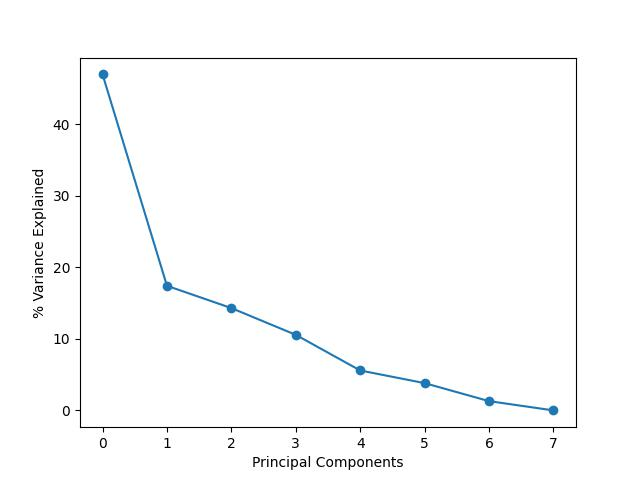
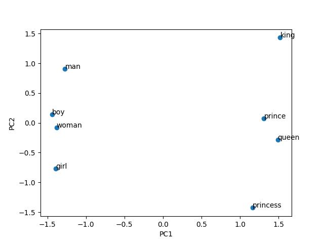

## Load pre-trained model via Gensim
First, load the Word2Vec embedding model. The Word2Vec model takes 3-10 minutes to load. 

We'll be using the Gensim library. The Gensim library comes with several word embedding models including Word2Vec, GloVe, and fastText. We'll start by exploring one of the pre-trained Word2Vec models. We'll discuss the other options later in this lesson.

If you can't get the below word2vec model to load quickly enough, you can use the GloVe model, instead. The GloVe model produces word embeddings that are often very similar to Word2Vec. GloVe can be loaded with:```wv = api.load('glove-wiki-gigaword-50')```

```python
# RUN BEFORE INTRO LECTURE :)

# api to load word2vec models
import gensim.downloader as api

# takes 3-10 minutes to load
wv = api.load('word2vec-google-news-300') # takes 3-10 minutes to load 
```

## Document/Corpus Embeddings Recap

So far, we’ve seen how word counts, TF-IDF, and LSA can help us embed a document or set of documents into useful vector spaces that allow us to gain insights from text data. Let's review the embeddings covered thus far...

* **TF-IDF embeddings:** Determines the mathematical significance of words across multiple documents. It's embedding is based on token/word frequency within each document and relative to how many documents a token appears in. 

* **LSA embeddings:** Latent Semantic Analysis (LSA) is used to find the hidden topics represented by a group of documents. It involves running singular-value decomposition (SVD) on a document-term matrix (typically the TF-IDF matrix), producing a vector representation of each document. This vector scores each document's representation in different topic/concept areas which are derived based on word co-occurences. Importantly, LSA is considered a *bag of words* method since the order of words in a document is not considered. 

### LSA vs TF-IDF
Compared to TF-IDF, the text representations (a.k.a. embeddings) produced by LSA are arguably more useful since LSA can reveal some of the latent topics referenced throughout a corpus. While LSA gets closer to extracting some of the interesting features of text data, it is limited in the sense that it is a "bag of words" method. That is, it pays no attention to the context in which words appear. Instead, it focuses only on word co-occurrence patterns within and across documents. While such an approach is effective for revealing topics/concepts, additional features of language may be revealed by zooming in on the context in which words appear throughout a text.

## Distributional hypothesis: extracting more meaningful representations of text 
As the famous linguist JR Firth once said, “You shall know a word by the company it keeps.” Firth is referring to the *distributional hypothesis*, which states that words that repeatedly occur in similar contexts probably have similar meanings. While the LSA methodology is inspired by the distributional hypothesis, LSA ignores the context of words as they appear in sentences and only pays attention to global word co-occurence patterns across large chunks of texts. If we want to truly know a word based on the company it keeps, we'll need to take into account how some words are more likely to appear before/after other words in a sentence. We'll explore how one of the most famous embedding models, Word2Vec, does this in this episode.

## Word embeddings with Word2Vec
Word2vec is a famous *word embedding* method that was created and published in 2013 by a team of researchers led by Tomas Mikolov at Google over two papers, [[1](https://arxiv.org/abs/1301.3781), [2](https://arxiv.org/abs/1310.4546)]. Unlike with TF-IDF and LSA, which are typically used to produce document and corpus embeddings, Word2Vec focuses on producing a single embedding for every word encountered in a corpus. These embeddings, which are represented as high-dimesional vectors, tend to look very similar for words that are used in similar contexts. 

We'll unpack the technology behind Word2Vec in the next episode (**spoiler alert**: it uses artificial neural networks). For now, it is sufficient to be aware of two key properties of the model.

1. Word2Vec is a machine learning model that generates high-dimensional representations of words based on observing a word's most likely surrounding words in multiple sentences (dist. hypothesis). For instance, notice how in the example sentences given below, the word outside tends to be surrounded by words associated with the outdoors.

    * *It's a beautiful day **outside**, perfect for a picnic.*
    * *My cat loves to spend time **outside**, chasing birds and bugs.*
    * *The noise **outside** woke me up early this morning.*
    * *I always feel more relaxed after spending some time **outside** in nature.*
    * *I can hear the rain pouring **outside**, it's a good day to stay indoors.*
    * *The sun is shining brightly **outside**, it's time to put on some sunscreen.*
    * *I saw a group of kids playing **outside** in the park.*
    * *It's not safe to leave your belongings **outside** unattended.*
    * *I love to go for a walk **outside** after dinner to help me digest.*
    * *The temperature **outside** is dropping, I need to grab a jacket before I leave.*\


2. The vectors produced by the model are a reflection of the model's past experience (i.e., the specific data the model was "trained" on). This means that the vectors extracted from the model will reflect, on average, how words are used in a specific text.

With that said, let's see what we can do with meaningful word vectors. The pre-trained model we loaded earlier was trained on a Google News dataset (about 100 billion words). We loaded this model as the variable ```wv``` earlier. Let's check the type of this object.

```python
print(type(wv))
```

~~~
<class 'gensim.models.keyedvectors.KeyedVectors'>
~~~
{: .output}

Gensim stores "KeyedVectors" representing the Word2Vec model. They're called keyed vectors because you can use words as keys to extract the corresponding vectors. Let's take a look at the vector representaton of *whale*.

```python
wv['whale'] 
```
~~~
array([ 0.08154297,  0.41992188, -0.44921875, -0.01794434, -0.24414062,
       -0.21386719, -0.16796875, -0.01831055,  0.32421875, -0.09228516,
       -0.11523438, -0.5390625 , -0.00637817, -0.41601562, -0.02758789,
        0.04394531, -0.15039062, -0.05712891, -0.03344727, -0.10791016,
        0.14453125,  0.17480469,  0.18847656,  0.02282715, -0.05688477,
       -0.13964844,  0.01379395,  0.296875  ,  0.53515625, -0.2421875 ,
       -0.22167969,  0.23046875, -0.20507812, -0.23242188,  0.0123291 ,
        0.14746094, -0.12597656,  0.25195312,  0.17871094, -0.00106812,
       -0.07080078,  0.10205078, -0.08154297,  0.25390625,  0.04833984,
       -0.11230469,  0.11962891,  0.19335938,  0.44140625,  0.31445312,
       -0.06835938, -0.04760742,  0.37890625, -0.18554688, -0.03063965,
       -0.00386047,  0.01062012, -0.15527344,  0.40234375, -0.13378906,
       -0.00946045, -0.06103516, -0.08251953, -0.44335938,  0.29101562,
       -0.22753906, -0.29296875, -0.13671875, -0.08349609, -0.25585938,
       -0.12060547, -0.16113281, -0.27734375,  0.01318359, -0.23730469,
        0.0300293 ,  0.01348877, -0.07226562, -0.02429199, -0.18945312,
        0.05419922, -0.12988281,  0.26953125, -0.11669922,  0.01000977,
        0.05883789, -0.03515625, -0.09375   ,  0.35742188, -0.1875    ,
       -0.06347656,  0.44726562,  0.05761719,  0.3125    ,  0.06347656,
       -0.24121094,  0.3125    ,  0.31054688,  0.11132812, -0.08447266,
        0.06445312, -0.02416992,  0.16113281, -0.1875    ,  0.2109375 ,
       -0.05981445,  0.00524902,  0.13964844,  0.09765625,  0.06835938,
       -0.43945312,  0.01904297,  0.33007812,  0.12011719,  0.08251953,
       -0.08642578,  0.02270508, -0.09472656, -0.21289062,  0.01092529,
       -0.05493164,  0.0625    , -0.0456543 ,  0.06347656, -0.14160156,
       -0.11523438,  0.28125   , -0.09082031, -0.46679688,  0.11035156,
        0.07275391,  0.12988281, -0.32421875,  0.10595703,  0.13085938,
       -0.29101562,  0.02880859,  0.07568359, -0.03637695,  0.16699219,
        0.15917969, -0.08007812,  0.109375  ,  0.4140625 ,  0.30859375,
        0.22558594, -0.22070312,  0.359375  ,  0.08105469,  0.21386719,
        0.59765625,  0.01782227, -0.5859375 ,  0.21777344,  0.18164062,
       -0.08398438,  0.07128906, -0.27148438, -0.11230469, -0.00915527,
        0.10400391,  0.19628906,  0.09912109,  0.09667969,  0.24414062,
       -0.11816406,  0.02758789, -0.26757812, -0.07421875,  0.20410156,
       -0.140625  , -0.03515625,  0.22265625,  0.32226562, -0.18066406,
       -0.30078125, -0.05981445,  0.34765625, -0.2578125 ,  0.0546875 ,
       -0.05541992, -0.46289062, -0.18945312,  0.00668335,  0.15429688,
        0.07275391,  0.07373047, -0.07275391,  0.09765625,  0.03491211,
       -0.33203125, -0.14257812, -0.23046875, -0.13085938, -0.0035553 ,
        0.28515625,  0.25390625, -0.05102539,  0.01318359, -0.16113281,
        0.12353516, -0.39257812, -0.42578125, -0.2578125 , -0.15332031,
       -0.01403809,  0.21972656, -0.04296875,  0.04907227, -0.328125  ,
       -0.46484375,  0.00546265,  0.17089844, -0.10449219, -0.38476562,
        0.13378906,  0.65625   , -0.22363281,  0.15039062,  0.19824219,
        0.3828125 ,  0.10644531,  0.38671875, -0.11816406, -0.00616455,
       -0.19628906,  0.04638672,  0.20507812,  0.36523438,  0.04174805,
        0.45117188, -0.29882812, -0.09228516, -0.31835938,  0.15234375,
       -0.07421875,  0.07128906,  0.25195312,  0.14746094,  0.27148438,
        0.4609375 , -0.4375    ,  0.10302734, -0.49414062, -0.01342773,
       -0.20019531,  0.0456543 ,  0.0402832 , -0.11181641,  0.01489258,
       -0.7421875 , -0.0055542 , -0.21582031, -0.15527344,  0.29296875,
       -0.05981445,  0.02905273, -0.08105469, -0.03955078, -0.17089844,
        0.07080078,  0.00671387, -0.17285156,  0.08544922, -0.11621094,
        0.10253906, -0.24316406, -0.04882812,  0.20410156, -0.27929688,
       -0.21484375,  0.07470703,  0.11767578,  0.6640625 ,  0.29101562,
        0.02404785, -0.65234375,  0.13378906, -0.01867676, -0.07373047,
       -0.18359375, -0.0201416 ,  0.29101562,  0.06640625,  0.04077148,
       -0.10888672,  0.15527344,  0.12792969,  0.375     ,  0.2890625 ,
        0.30078125, -0.15625   , -0.05224609, -0.19042969,  0.10595703,
        0.078125  ,  0.29882812,  0.34179688,  0.04248047,  0.03442383],
      dtype=float32)
~~~
{: .output}

We can also check the shape of this vector with...

```python
print(wv['whale'].shape) 
```
~~~
(300,)
~~~
{: .output}

In this model, each word has a 300-dimensional representation. You can think of these 300 dimensions as 300 different features that encode a word's meaning. Unlike LSA, which produces (somewhat) interpretable features (i.e., topics) relevant to a text, the features produced by Word2Vec will be treated as a black box. That is, we won't actually know what each dimension of the vector represents. However, if the vectors have certain desirable properties (e.g., similar words produce similar vectors), they can still be very useful. Let's check this with the help of the cosine similarity measure.

**Cosine Similarity (Review)**: Recall from earlier in the workshop that cosine similarity helps evaluate vector similarity in terms of the angle that separates the two vectors, irrespective of vector magnitude. It can take a value ranging from -1 to 1, with...
* 1 indicating that the two vectors share the same angle
* 0 indicating that the two vectors are perpendicular or 90 degrees to one another
* -1 indicating that the two vectors are 180 degrees apart.

Words that occur in similar contexts should have similar vectors/embeddings. How similar are the word vectors representing *whale* and *dolphin*?

```python
wv.similarity('whale','dolphin')
```
~~~
0.77117145
~~~
{: .output}

How about *whale* and *fish*?

```python
wv.similarity('whale','fish')
```
~~~
0.55177623
~~~
{: .output}

How about *whale* and... *potato*?

```python
wv.similarity('whale','potato')
```

~~~
0.15530972
~~~
{: .output}

Our similarity scale seems to be on the right track. We can also use the similarity function to quickly extract the top N most similar words to *whale*.

```python
wv.most_similar(positive=['whale'], topn=10)
```

~~~
[('whales', 0.8474178910255432),
 ('humpback_whale', 0.7968777418136597),
 ('dolphin', 0.7711714506149292),
 ('humpback', 0.7535837292671204),
 ('minke_whale', 0.7365031838417053),
 ('humpback_whales', 0.7337379455566406),
 ('dolphins', 0.7213870882987976),
 ('humpbacks', 0.7138717174530029),
 ('shark', 0.7011443376541138),
 ('orca', 0.7007412314414978)]
~~~
{: .output}

Based on our ability to recover similar words, it appears the Word2Vec embedding method produces fairly good (i.e., semantically meaningful) word representations. 

> ## Exploring Words With Multiple Meanings
>
> Use Gensim's ```most_similar``` function to find the top 10 most similar words to each of the following words (separately): 
> "bark", "pitcher", "park". Note that all of these words have multiple meanings depending on their context. 
> Does Word2Vec capture the meaning of these words well? Why or why not? 
> 
> > ## Solution
> > 
> > Based on these three lists, it looks like Word2Vec is biased towards representing the predominant meaning or sense of a word. In fact, the Word2Vec does not explicitly differentiate between multiple meanings of a word during training. Instead, it treats each occurrence of a word in the training corpus as a distinct symbol, regardless of its meaning. As a result, resulting embeddings may be biased towards the most frequent meaning or sense of a word. This is because the more frequent a word sense appears in the training data, the more opportunities the algorithm has to learn its representation.
> > 
> > Note that while this can be a limitation of Word2Vec, there are some techniques that can be applied to incorporate word sense disambiguation. One common approach is to train multiple embeddings for a word, where each embedding corresponds to a specific word sense. This can be done by pre-processing the training corpus to annotate word senses, and then training Word2Vec embeddings separately for each sense. This approach allows Word2Vec to capture different word senses as separate vectors, effectively representing the polysemy of the word.
> {:.solution}
{:.challenge}

> ## Word2Vec Applications in Digital Humanities
> From the above exercise, we see that the vectors produced by Word2Vec will reflect how words are typically used in a specific dataset. By training Word2Vec on large corpora of text from historical documents, literary works, or cultural artifacts, researchers can uncover semantic relationships between words and analyze word usage patterns over time, across genres, or within specific cultural contexts.
> 
> Taking this into consideration, what are some possible ways we could make use of Word2Vec to explore newspaper articles from the years 1900-2000?
> > ## Solution
> > 
> > One possible approach with this data is to investigate how the meaning of certain words can evolve over time by training separate models for different chunks of time (e.g., 1900-1950, 1951-2000, etc.). A few words that have changed their meaning over time include:
> > * Nice: This word used to mean “silly, foolish, simple.” 
> > * Silly: In its earliest uses, it referred to things worthy or blessed; from there it came to refer to the weak and vulnerable, and more recently to those who are foolish.
> > * Awful: Awful things used to be “worthy of awe”.
> > 
> > We'll explore how training a Word2Vec model on specific texts can yield insights into those texts later in this lesson.
> {:.solution}
{:.challenge}

### Adding and Subtracting Vectors: King - Man + Woman = Queen
We can also add and subtract word vectors to reveal latent meaning in words. As a canonical example, let's see what happens if we take the word vector representing *King*, subtract the *Man* vector from it, and then add the *Woman* vector to the result. We should get a new vector that closely matches the word vector for *Queen*. We can test this idea out in Gensim with:

```python
print(wv.most_similar(positive=['woman','king'], negative=['man'], topn=3))
```

~~~
[('queen', 0.7118193507194519), ('monarch', 0.6189674139022827), ('princess', 0.5902431011199951)]
~~~
{: .output}

Behind the scenes of the most_similar function, Gensim first unit normalizes the *length* of all vectors included in the positive and negative function arguments. This is done before adding/subtracting, which prevents longer vectors from unjustly skewing the sum. Note that length here refers to the linear algebraic definition of summing the squared values of each element in a vector followed by taking the square root of that sum.

### Visualizing word vectors with PCA

Similar to how we visualized our texts in the previous lesson to show how they relate to one another, we can visualize how a sample of words relate by plotting their respecitve word vectors. 

Let's start by extracting some word vectors from the pre-trained Word2Vec model.

```python
import numpy as np
words = ['man','woman','boy','girl','king','queen','prince','princess']
sample_vectors = np.array([wv[word] for word in words])
sample_vectors.shape # 8 words, 300 dimensions 
```
~~~
(8, 300)
~~~
{: .output}

Recall that each word vector has 300 dimensions that encode a word's meaning. Considering humans can only visualize up to 3 dimensions, this dataset presents a plotting challenge. We could certainly try plotting just the first 2 dimensions or perhaps the dimensions with the largest amount of variability, but this would overlook a lot of the information stored in the other dimensions/variables. Instead, we can use a *dimensionality-reduction* technique known as Principal Component Analysis (PCA) to allow us to capture most of the information in the data with just 2 dimensions.

#### Principal Component Analysis (PCA)
Principal Component Analysis (PCA) is a data transformation technique that allows you to linearly combine a set of variables from a matrix (*N* observations and *M* variables) into a smaller set of variables called components. Specifically, it remaps the data onto new dimensions that are strictly orthogonal to one another and can be ordered according to the amount of information or variance they carry. The allows you to easily visualize *most* of the variability in the data with just a couple of dimensions.

We'll use scikit-learn's (a popular machine learning library) PCA functionality to explore the power of PCA, and matplotlib as our plotting library.

```python
from sklearn.decomposition import PCA
import matplotlib.pyplot as plt
```

In the code below, we will assess how much variance is stored in each dimension following PCA. The new dimensions are often referred to as principal components or eigenvectors, which relates to the underlying math behind this algorithm.

Notice how the first two dimensions capture around 70% of the variability in the dataset.

```python
pca = PCA() # init PCA object
pca.fit(sample_vectors) # the fit function determines the new dimensions or axes to represent the data -- the result is sent back to the pca object

# plot variance explained by each new dimension (principal component)
plt.figure()
plt.plot(pca.explained_variance_ratio_*100,'-o')
plt.xlabel("Principal Components")
plt.ylabel("% Variance Explained")
plt.savefig("wordEmbeddings_word2vecPCAvarExplained.jpg")

```    



We can now use these new dimensions to transform the original data.

```python
# transform the data
result = pca.transform(sample_vectors)
```
 Once transformed, we can plot the first two principal components representing each word in our list: ```['man', 'woman', 'boy', 'girl', 'king', 'queen', 'prince', 'princess']```


```python
plt.figure()
plt.scatter(result[:,0], result[:,1])
for i, word in enumerate(words):
  plt.annotate(word, xy=(result[i, 0], result[i, 1]))

plt.xlabel("PC1")
plt.ylabel("PC2")
plt.show()
```    


Note how the principal component 1 seems to represent the royalty dimension, while the principal component 2 seems to represent male vs female. 

## Recap
In summary, Word2Vec is a powerful text-embedding method that allows researchers to explore how different words relate to one another based on past observations (i.e., by being trained on a large list of sentences). Unlike LSA, which produces topics as features of the text to investigate, Word2Vec produces "black-box" features which have to be compared relative to one another. By training Word2Vec text from historical documents, literary works, or cultural artifacts, researchers can uncover semantic relationships between words and analyze word usage patterns over time, across genres, or within specific cultural contexts.

In the next section, we'll explore the technology behind Word2Vec before training a Word2Vec model on some of the text data used in this workshop.
